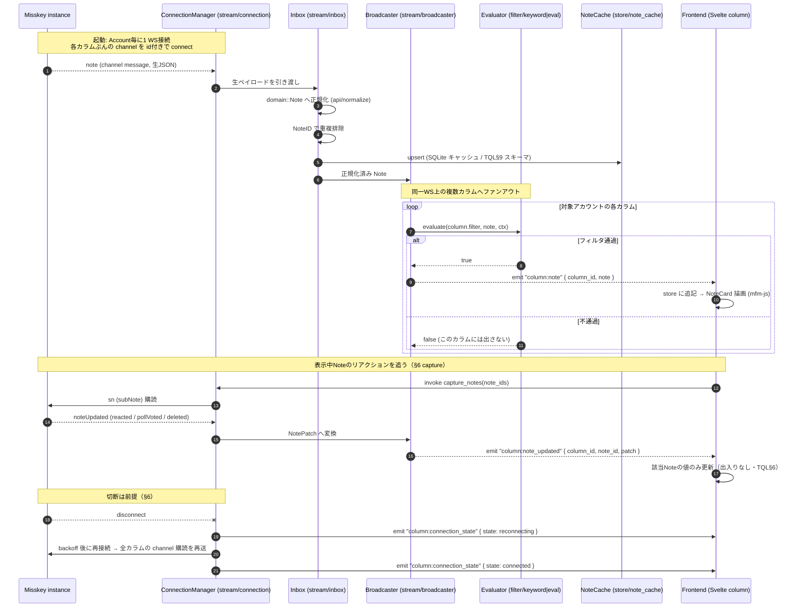
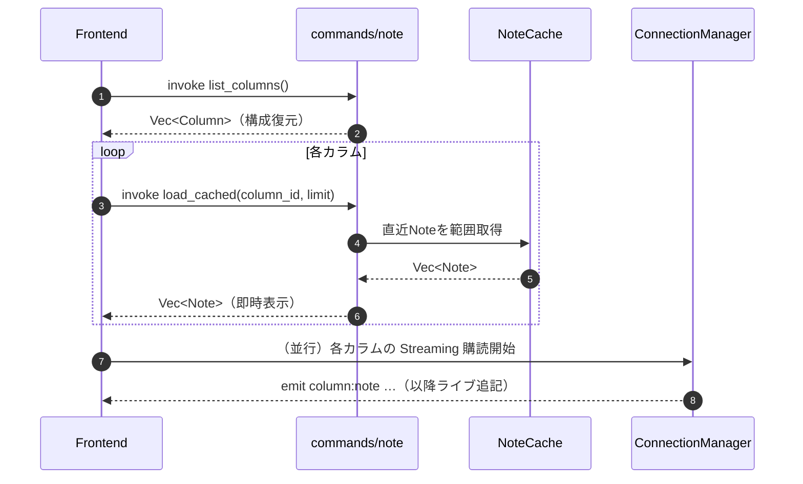

# Phase 0 — 設計とスキャフォールド

- 作成日: 2026-07-05
- 対象: `misskey-client-prompts.md` Phase 0
- 前提資料: `misskey-multicolumn-client-design.md`（設計書=正）／`filter-dsl-design.md`（TQL）
- 本書の位置づけ: **実装コードは書かず**、(1) リポジトリ構成、(2) 主要ドメインモデルの下書き、(3) Rust↔フロント境界（command/event）、(4) データフロー図 の4点を確定するための設計成果物。

> 設計書と矛盾する場合は設計書を正とする。本書はレイヤー構成(§4)・データモデル(§5)・IPC一覧(§9)・TQL構成(§5)を Phase 0 の粒度に落とし込んだもの。

---

## 1. リポジトリ構成（ディレクトリツリー）

ハイブリッド構成（Rust=Model層 / フロント=ViewModel+View）を、設計書§4のレイヤーにそのまま対応させる。`src-tauri` 側を `api / stream / store / filter / session` の5系統に分割し、`frontend` を `ui / render / input` に分割する。

```
tsumugi/
├─ docs/
│  ├─ misskey-multicolumn-client-design.md   # 設計書（正）
│  ├─ filter-dsl-design.md                    # TQL 設計
│  ├─ misskey-client-prompts.md               # ロードマップ
│  └─ phase0-scaffold.md                      # 本書
│
├─ src-tauri/                                 # Rust Core = Krile の Model層
│  ├─ Cargo.toml
│  ├─ tauri.conf.json
│  ├─ build.rs                                # tauri_build::build() のみ（progenitorは不採用。§6.1）
│  ├─ openapi/
│  │  └─ misskey-api-doc.json                 # 対象バージョンの OpenAPI スナップショット（固定）
│  └─ src/
│     ├─ main.rs                              # Tauri エントリ。command 登録・specta 型 export
│     ├─ lib.rs                               # AppState / 依存の組み立て（DI ルート）
│     ├─ error.rs                             # 型付き Error（ネットワーク/レート/権限/パース）
│     │
│     ├─ domain/                              # 正規化済みドメイン型（§2・specta::Type 付与）
│     │  ├─ mod.rs
│     │  ├─ note.rs                           # Note / Visibility / DriveFile / Poll
│     │  ├─ user.rs                           # User（acct() 等）
│     │  ├─ account.rs                        # Account（token本体は持たない）
│     │  ├─ column.rs                         # Column / ColumnKind / FilterQuery
│     │  └─ reaction.rs                       # EmojiDef（絵文字ピッカー用）/ ReactionSummary
│     │
│     ├─ api/                                 # REST クライアント（薄い型付きラッパ）
│     │  ├─ mod.rs
│     │  ├─ (generated.rs は未採用)            # progenitor不採用のため生成物なし。全て手書きラッパ
│     │  ├─ client.rs                         # 全 POST・`i` 同梱の共通処理を1箇所に集約
│     │  ├─ notes.rs                          # timeline / create / delete / reactions ラッパ
│     │  ├─ meta.rs                           # i / meta / emojis（カスタム絵文字取得）
│     │  └─ normalize.rs                      # 生レスポンス → domain::Note へ正規化
│     │
│     ├─ stream/                              # Streaming（OpenAPI仕様外・自前実装。§6）
│     │  ├─ mod.rs
│     │  ├─ connection.rs                     # Account毎に1 WS。ping/pong・backoff再接続
│     │  ├─ protocol.rs                       # connect/disconnect/channel/sn 等メッセージ型（手書き）
│     │  ├─ subscription.rs                   # channel購読idのライフサイクル
│     │  ├─ capture.rs                        # 表示中Noteの sn(subNote) 動的キャプチャ
│     │  ├─ inbox.rs                          # 受信 → 正規化 → NoteIDで重複排除
│     │  └─ broadcaster.rs                    # 各カラム評価器へファンアウト → event 発火
│     │
│     ├─ store/                               # 永続化（SQLite / keyring）
│     │  ├─ mod.rs
│     │  ├─ db.rs                             # 接続・マイグレーション実行
│     │  ├─ schema.sql                        # note/user/note_* テーブル（TQL§9をそのまま）
│     │  ├─ migrations/                       # スキーマ移行（バージョン管理）
│     │  ├─ note_cache.rs                     # Note の upsert / 範囲取得 / 既読位置
│     │  ├─ settings.rs                       # Account/Column 構成の永続化
│     │  └─ secrets.rs                        # keyring ラッパ。token は Core 内のみ
│     │
│     ├─ filter/                              # フィルタ評価（MVP=キーワード / 将来=TQL。§5・TQL§5）
│     │  ├─ mod.rs
│     │  ├─ keyword.rs                        # MVP: 部分一致キーワード評価
│     │  ├─ token.rs                          # TQL: 字句解析（Phase 4）
│     │  ├─ parser.rs                         # TQL: 再帰下降 + 型検査
│     │  ├─ ast.rs                            # TQL: Expr / Value / Field / Source
│     │  ├─ eval.rs                           # TQL: インメモリ評価（Streaming受信時）
│     │  ├─ sql.rs                            # TQL: SQLite WHERE 射影（キャッシュ検索）
│     │  ├─ source.rs                         # from節ソース → Receiver 起動
│     │  └─ context.rs                        # EvalContext（mine/following/to_me 解決）
│     │
│     ├─ session/                             # 認証・アカウント管理（Krile AccountManager相当）
│     │  ├─ mod.rs
│     │  ├─ miauth.rs                         # MiAuth フロー（URL生成・callback・token取得）
│     │  ├─ account_manager.rs               # 複数アカウント状態・切替
│     │  └─ registry.rs                       # account_id → (api client, ws connection) 束ね
│     │
│     └─ commands/                            # Tauri command ハンドラ（invoke 対象。§3）
│        ├─ mod.rs                            # collect_commands! 集約
│        ├─ account.rs                        # add/remove/list/switch/whoami
│        ├─ column.rs                         # add/update/remove/reorder
│        ├─ note.rs                           # timeline取得 / post / delete / renote
│        ├─ reaction.rs                       # react / unreact / emoji一覧
│        └─ capture.rs                        # note の表示/非表示に伴う sn 購読制御
│
└─ frontend/                                  # Svelte + Vite = ViewModel + View
   ├─ package.json
   ├─ vite.config.ts
   ├─ index.html
   └─ src/
      ├─ main.ts                              # Svelte マウント
      ├─ App.svelte                           # 横並びカラムのシェル
      │
      ├─ bindings/
      │  └─ tauri.gen.ts                      # tauri-specta 生成型・invoke/event ラッパ（自動生成）
      │
      ├─ lib/
      │  ├─ ipc.ts                            # invoke ラッパ（bindings 経由）
      │  └─ events.ts                         # event listen 購読の集中管理
      │
      ├─ stores/                              # ViewModel（Svelte store）
      │  ├─ accounts.ts
      │  ├─ columns.ts                        # カラム構成・並び順・幅
      │  └─ timeline.ts                       # column_id → Note[] リングバッファ
      │
      ├─ ui/                                  # View: 画面・カラム
      │  ├─ ColumnList.svelte                 # 横スクロールのカラム束
      │  ├─ Column.svelte                     # 1カラム（仮想スクロール）
      │  ├─ NoteCard.svelte                   # 1ノート表示
      │  ├─ AddColumnModal.svelte
      │  ├─ ComposeModal.svelte               # 投稿フォーム（可視性/CW/添付/投票）
      │  └─ AccountManager.svelte
      │
      ├─ render/                              # MFM・メディア描画
      │  ├─ Mfm.svelte                        # mfm-js AST → DOM
      │  ├─ MfmNode.svelte                    # 再帰ノード（mention/hashtag/emoji/link）
      │  ├─ CustomEmoji.svelte
      │  └─ MediaGrid.svelte                  # drive 添付サムネイル
      │
      └─ input/                               # 入力・操作
         ├─ ReactionPicker.svelte
         ├─ VisibilitySelect.svelte
         └─ PollEditor.svelte
```

**分割の意図**
- `api`（REST）と `stream`（WS）を分けるのは、前者が OpenAPI 生成物中心・後者が全面手書きという実装コストの性質差（設計書§6.1）に対応させるため。
- `filter` は MVP の `keyword.rs` と将来の TQL 一式を同居させ、`Column.filter` の型を差し替えるだけで移行できるようにする（§2.6）。
- `domain` を独立させ、`api`(正規化先)・`stream`(評価対象)・`store`(永続化)・`filter`(評価入力)・`commands`(IPCペイロード) 全てがここを共有する。TS 型はここから `tauri-specta` で一括生成。

---

## 2. 主要ドメインモデル（Rust struct 下書き）

`domain/` に置く。全型に `serde::{Serialize,Deserialize}` + `specta::Type` を付け、`tauri-specta` で TS 型を生成する（二重管理しない・必須）。`Note`/`User`/`DriveFile`/`Poll` は TQL§7・設計書§5.1 で確定済みの定義をそのまま採用する（フィルタ評価語彙と過不足なく揃えるため）。

> serde 命名規約: フロント(TS)を camelCase に揃えるため、複数語フィールドを持つ型には `#[serde(rename_all = "camelCase")]` を付ける。Rust側は snake_case のまま。

### 2.1 Account（設定データ。token本体は持たない）

```rust
use serde::{Serialize, Deserialize};
use specta::Type;

/// 設計書§5。token本体は keyring に保管し、DB・本structには参照キーのみ。
/// フロントへ token を渡す command は設けない。
#[derive(Debug, Clone, Serialize, Deserialize, Type)]
#[serde(rename_all = "camelCase")]
pub struct Account {
    pub id: String,                 // UUID（TS都合で String 表現）
    pub host: String,               // "misskey.io"
    pub username: String,           // ログインユーザ名（@なし）
    pub user_id: String,            // インスタンス上の userId（mine/to_me 判定に使う）
    pub display_name: String,
    pub avatar_url: Option<String>,
    // token本体は含めない。keyring キーは Core 内の store::secrets が id から導出
}
```

### 2.2 User（TQL§7 / 設計書§5.1）

```rust
#[derive(Debug, Clone, Serialize, Deserialize, Type)]
#[serde(rename_all = "camelCase")]
pub struct User {
    pub id: String,
    pub username: String,           // @なし
    pub host: Option<String>,       // None=ローカル
    pub name: Option<String>,       // 表示名
    pub is_bot: bool,
    pub is_cat: bool,
    pub followers_count: u32,
    pub following_count: u32,
    pub notes_count: u32,
}
// acct() -> "@user" or "@user@host" は impl 側（TQL§7）
```

### 2.3 Note（TQL§7 / 設計書§5.1）

```rust
use std::collections::HashMap;

#[derive(Debug, Clone, Serialize, Deserialize, Type)]
#[serde(rename_all = "camelCase")]
pub struct Note {
    pub id: String,                 // aid/aidx。数値比較しない
    pub created_at: i64,            // epoch秒。時間比較はこれ
    pub text: Option<String>,       // MFM原文。純Renoteは None
    pub cw: Option<String>,
    pub visibility: Visibility,
    pub local_only: bool,
    pub user: User,
    pub reply_id: Option<String>,
    pub renote_id: Option<String>,
    pub renote: Option<Box<Note>>,  // 引用/Renote先（浅く保持）
    pub files: Vec<DriveFile>,
    pub poll: Option<Poll>,
    pub tags: Vec<String>,
    pub mentions: Vec<String>,       // メンション先 userId
    pub emojis: Vec<String>,
    pub channel_id: Option<String>,
    pub via: Option<String>,
    pub lang: Option<String>,

    // 可変集計部（noteUpdated で更新。§10方針=値は更新するが出入りはしない）
    pub reactions: HashMap<String, u32>, // キー=Misskey形式（Unicode生 or :name@host:）
    pub reaction_count: u32,
    pub renote_count: u32,
    pub reply_count: u32,
    pub my_reaction: Option<String>,
    pub is_renoted_by_me: bool,
    pub is_favorited_by_me: bool,
    pub is_pinned: bool,
}

#[derive(Debug, Clone, Copy, PartialEq, Eq, Serialize, Deserialize, Type)]
#[serde(rename_all = "camelCase")]
pub enum Visibility { Public, Home, Followers, Specified } // Specified = direct
```

### 2.4 DriveFile / Poll（TQL§7）

```rust
#[derive(Debug, Clone, Serialize, Deserialize, Type)]
#[serde(rename_all = "camelCase")]
pub struct DriveFile {
    pub id: String,
    pub mime_type: String,          // file_types はここから category 化
    pub is_sensitive: bool,
    pub url: String,
    pub thumbnail_url: Option<String>,
}

#[derive(Debug, Clone, Serialize, Deserialize, Type)]
#[serde(rename_all = "camelCase")]
pub struct Poll {
    pub choices: Vec<PollChoice>,
    pub multiple: bool,
    pub expires_at: Option<i64>,
}

#[derive(Debug, Clone, Serialize, Deserialize, Type)]
#[serde(rename_all = "camelCase")]
pub struct PollChoice { pub text: String, pub votes: u32, pub is_voted: bool }
```

### 2.5 Reaction（絵文字ピッカー用の絵文字定義 / 集計表示）

> **重要な区別**: `Note.reactions` は「絵文字キー→集計数」の `HashMap` であり、**誰がリアクションしたかは Misskey が返さない**（設計書§5.1注意 / TQL§3.4）。したがって「Reaction」は個々のリアクションイベントではなく、(a) **リアクションピッカーに並べる絵文字定義** と (b) **表示用の集計エントリ** の2つを指す。

```rust
/// (a) リアクションピッカー用。カスタム絵文字はインスタンス単位でキャッシュ（未確定§6）。
#[derive(Debug, Clone, Serialize, Deserialize, Type)]
#[serde(rename_all = "camelCase")]
pub struct EmojiDef {
    pub name: String,               // "blobcat"（:なし）
    pub host: Option<String>,       // None=ローカル
    pub url: String,
    pub category: Option<String>,
    pub aliases: Vec<String>,       // 検索用
}

/// (b) NoteCard 表示用の集計エントリ（HashMap を並び順付きに展開したもの）
#[derive(Debug, Clone, Serialize, Deserialize, Type)]
#[serde(rename_all = "camelCase")]
pub struct ReactionSummary {
    pub key: String,                // Misskey形式キー（Unicode生 or :name@host:）
    pub count: u32,
    pub reacted_by_me: bool,        // my_reaction == key
    pub emoji_url: Option<String>,  // カスタム絵文字なら解決した URL
}
```

### 2.6 Column / ColumnKind / FilterQuery

MVP は部分一致キーワードのみ。将来の TQL 導入時に `FilterQuery` のバリアントを増やすだけで移行できるよう、フィルタを **enum で抽象化** しておく（設計書§5.1「将来は Query AST に置き換える」に対応）。

```rust
#[derive(Debug, Clone, Serialize, Deserialize, Type)]
#[serde(rename_all = "camelCase")]
pub struct Column {
    pub id: String,                 // UUID
    pub account_id: String,
    pub kind: ColumnKind,
    pub order: i32,
    pub width: i32,
    pub filter: FilterQuery,
    pub notify_sound: bool,
    pub notify_desktop: bool,
}

/// 設計書§8.2 の MVP スコープ。Antenna 等は将来拡張（TQL§2 のソースが上位互換）。
#[derive(Debug, Clone, Serialize, Deserialize, Type)]
#[serde(rename_all = "camelCase", tag = "type")]
pub enum ColumnKind {
    Home,
    Local,
    Global,
    Hybrid,
    Notifications,
    List { list_id: String },
    Search { query: String },
    // 将来: Antenna { antenna_id }, Channel { channel_id }, User { acct }, Tag { tag }, Cache
}

/// MVP=Keywords のみ。将来 TQL 導入で Tql を有効化（filter/ast.rs の Query を保持）。
#[derive(Debug, Clone, Serialize, Deserialize, Type)]
#[serde(rename_all = "camelCase", tag = "kind", content = "value")]
pub enum FilterQuery {
    /// 部分一致キーワード（OR）。空 Vec = 素通し。
    Keywords(Vec<String>),
    /// Phase 4: TQL クエリ文字列（保存形）。パース結果 AST は Core 側でキャッシュ。
    Tql(String),
}
```

> **フロント↔DB の扱い**: `Column`/`Account` は `store::settings` が SQLite に永続化する設定データ。`Note` は `store::note_cache` が別途キャッシュ（TQL§9 スキーマ）。`FilterQuery::Tql` の中身の評価は `filter/` 一式（Phase 4）に委譲し、MVP では `Keywords` のみ `filter/keyword.rs` が処理する。

---

## 3. Rust↔フロント境界（Tauri command / event）

`tauri-specta` で command シグネチャと event ペイロード型をまとめて TS へ出力（`frontend/src/bindings/tauri.gen.ts`）。**token を含むペイロードは一切定義しない。**

### 3.1 Command（フロント → Rust。要求系 / invoke）

| コマンド | 引数 | 戻り値 | 用途 |
|---|---|---|---|
| **アカウント** | | | |
| `start_miauth` | `host: String` | `MiAuthSession { url, session_id }` | MiAuth 認証URLを生成（ブラウザで開く） |
| `complete_miauth` | `session_id: String` | `Account` | callback後にtoken取得→keyring保存→Account返却 |
| `list_accounts` | — | `Vec<Account>` | 登録済みアカウント一覧 |
| `switch_account` | `account_id: String` | `()` | 既定アカウント切替 |
| `remove_account` | `account_id: String` | `()` | 削除（関連カラムも削除） |
| `whoami` | `account_id: String` | `User` | i/me 相当 |
| **カラム** | | | |
| `add_column` | `account_id, kind: ColumnKind, order: i32` | `Column` | カラム追加（Receiver起動） |
| `update_column` | `column_id, patch: ColumnPatch` | `Column` | 幅/フィルタ/通知設定変更 |
| `remove_column` | `column_id: String` | `()` | カラム削除（購読解除） |
| `reorder_columns` | `ordered_ids: Vec<String>` | `()` | 並べ替え（D&D 反映） |
| `list_columns` | — | `Vec<Column>` | 起動時のカラム構成復元 |
| **タイムライン取得** | | | |
| `fetch_backfill` | `column_id, until_id: Option<String>` | `Vec<Note>` | 上スクロールで過去ページ取得 |
| `load_cached` | `column_id, limit: u32` | `Vec<Note>` | 起動時にSQLiteキャッシュから即時復元 |
| **投稿・操作** | | | |
| `post_note` | `account_id, draft: NoteDraft` | `Note` | 投稿（本文/CW/可視性/添付/投票/reply/quote） |
| `delete_note` | `account_id, note_id` | `()` | 削除 |
| `renote` | `account_id, note_id, visibility` | `Note` | Renote |
| `react` | `account_id, note_id, reaction: String` | `()` | リアクション付与（カスタム絵文字キー） |
| `unreact` | `account_id, note_id` | `()` | リアクション解除 |
| `upload_file` | `account_id, path or bytes` | `DriveFile` | drive アップロード（投稿添付用） |
| `list_emojis` | `account_id` | `Vec<EmojiDef>` | リアクションピッカー用（Coreでキャッシュ） |
| **キャプチャ** | | | |
| `capture_notes` | `account_id, note_ids: Vec<String>` | `()` | 表示領域に入ったNoteを sn 購読 |
| `uncapture_notes` | `account_id, note_ids: Vec<String>` | `()` | 表示領域外に出たら解除 |

補助ペイロード型（`domain` または `commands` に定義。全て `specta::Type`）:

```rust
pub struct ColumnPatch { width: Option<i32>, filter: Option<FilterQuery>,
                         notify_sound: Option<bool>, notify_desktop: Option<bool> }
pub struct NoteDraft { text: Option<String>, cw: Option<String>, visibility: Visibility,
                       file_ids: Vec<String>, poll: Option<PollDraft>,
                       reply_id: Option<String>, renote_id: Option<String>,
                       local_only: bool }
pub struct PollDraft { choices: Vec<String>, multiple: bool, expires_at: Option<i64> }
pub struct MiAuthSession { url: String, session_id: String }
```

### 3.2 Event（Rust → フロント。通知系 / emit）

設計書§9 のイベント表を基に、接続状態と通知を含めて確定。ペイロードは全て `specta::Type`。

| イベント名 | ペイロード | 用途 |
|---|---|---|
| `column:note` | `{ column_id: String, note: Note }` | 新規ノート受信（Broadcaster がフィルタ通過分のみ発火） |
| `column:note_updated` | `{ column_id, note_id, patch: NotePatch }` | リアクション/投票/カウント更新（値は更新・出入りなし。TQL§6） |
| `column:note_deleted` | `{ column_id, note_id }` | 削除（唯一カラムから除去するケース） |
| `column:connection_state` | `{ column_id, state: ConnectionState }` | 接続状態のUI表示 |
| `notification:new` | `{ account_id, notification: Notification }` | Notificationsカラム／デスクトップ通知トリガー |
| `account:state` | `{ account_id, state: AccountState }` | ログイン/切断など口座単位の状態 |
| `backstage:log` | `{ level, message, at }` | 操作ログ・エラー通知（将来 Phase 5 で本格化） |

```rust
#[derive(Serialize, Type)]
#[serde(rename_all = "camelCase")]
pub struct NotePatch {                 // noteUpdated の差分（可変集計部のみ）
    pub reactions: Option<HashMap<String, u32>>,
    pub reaction_count: Option<u32>,
    pub renote_count: Option<u32>,
    pub reply_count: Option<u32>,
    pub my_reaction: Option<Option<String>>, // 二重Option: 解除も表現
    pub poll: Option<Poll>,
}

#[derive(Serialize, Type)]
#[serde(rename_all = "camelCase")]
pub enum ConnectionState { Connecting, Connected, Reconnecting, Error }
```

> **設計上の要点**: フィルタ評価は Rust 側（Broadcaster→評価器）で行い、`column:note` はそのカラムのフィルタを通過した Note のみ発火する。フロントは column_id ごとに event を購読して末尾追記するだけ（Svelte の局所更新＝設計書§3.1 の狙いに合致）。

---

## 4. データフロー（mermaid シーケンス図）

Streaming受信 → Inbox（正規化・重複排除）→ Broadcaster → Column評価器 → event発火 → フロント描画、の流れ。1本のWS接続を複数カラムで共有する点（設計書§6）を表現する。



補助: 起動時の即時復元フロー（キャッシュ→Streaming追記。設計書§11 DoD）。



---

## 5. Phase 0 の完了条件と次アクション

**Phase 0 のアウトプット（本書）で確定したもの**
- [x] リポジトリ構成（src-tauri 5系統 / frontend 3系統）
- [x] ドメインモデル下書き（Account/Note/User/Reaction/DriveFile/Column/FilterQuery）
- [x] command 一覧（要求系）/ event 一覧（通知系）
- [x] データフロー（Streaming/capture/起動時復元）

**Phase 1 着手前の未確定（設計書§12 から Phase 0 に関わる分）**
- ~~`progenitor` が Misskey `api-doc.json` を処理できるか（実機検証）~~ → **【解決済み】** Phase 1で検証済み。OpenAPI 3.1.0非対応のため不採用、手書き型付きラッパ（`src-tauri/src/api/`）で実装（設計書§6.1参照）。`generated.rs`（progenitor生成物の再エクスポート）は採用していない。
- `Account.user_id` を MiAuth 完了時に i/me で確定させる導線（session/miauth）
- keyring キーの導出規則（`store/secrets`。account_id ベース）

**推奨する次の一手（Phase 0 時点）**: `misskey-client-prompts.md` Phase 1（認証とAPIクライアント）。まず `src-tauri` を Tauri v2 で scaffold し、`openapi/misskey-api-doc.json` を投入して `progenitor` 生成の可否を検証する。
（その後の実施結果: progenitorはOpenAPI 3.1.0非対応と判明し不採用、手書きラッパで実装済み。§6.1参照）

> ※本書はPhase 0時点の設計スナップショット。上記のprogenitor関連を除き、§1のディレクトリツリー等はPhase 0時点の想定であり、その後の実装で変化した箇所がある（最新の構成は[README.md](../README.md)を参照）。
